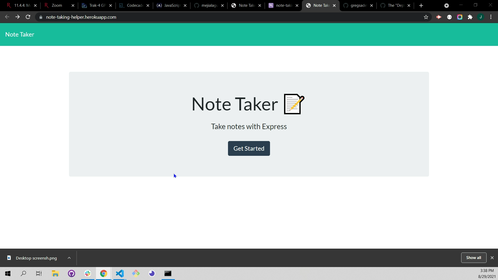
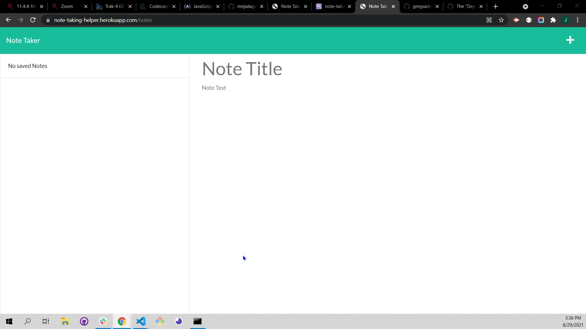
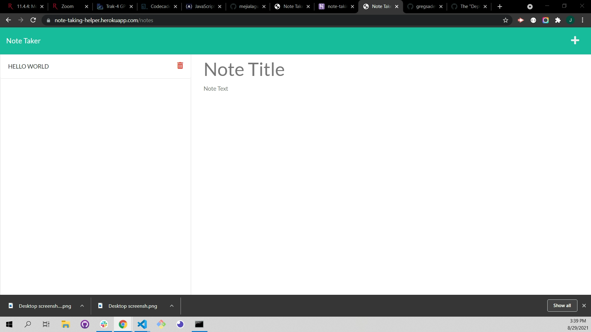

  <br/>
  <br/>
  
  <div align="center">
  
  <h1 align="center">Note-Taking-Helper</h1>
  <br/>
  <a href="#about"><strong>Explore the screenshots »</strong></a>
  <br/>
  <br/>
  
  </div>
  
  
  
  <div align="center">
  <br/>
  
  [](https://github.com/mejialaguna/note-taker.git)[](https://note-taking-helper.herokuapp.com)
[](https://opensource.org/licenses/MPL-2.0)
    
  </div>
  
  <br/>
  
  <details open="open">
  <summary>Table of Contents</summary>
  
  - [About](#about)
  - [Built With](#built-with)
  - [Authors & contributors](#authors--contributors)
  - [Installation](#installation)
  - [Acknowledgements](#Acknowledgements)
  - [License](#License) 
  
  </details>  
  
  <br/>
  
  ## About
  

  <br/>

This application will help and organize all your notes, starting from the more recent place to the previous one. if you want to use this app just click <a href="https://note-taking-helper.herokuapp.com" >Here</a> for a direct access and For any Question or to mention a bug please click  <a href="https://github.com/mejialaguna/note-taker/issues/1">here...</a>

  <br/>
  <br/>

  <details>
   <summary>Usage Screenshots and Demo</summary>
    
  <br/> 
  
   
  
  
  
  
  <br>
  <br>
  <br>

  <h3>To view full video please click <a href="https://drive.google.com/file/d/1tR_CkgsXbmltyAJ-NR12poZsofhZ05Be/view">here.</a></h3>

  </details>
  

  <br/>
  <br/>
  
  
  ## Built With
  

  <br/>

> - <a href="https://developer.mozilla.org/en-US/docs/Web/HTML">HTML</a>
> - <a href="https://getbootstrap.com/">CSS</a>
> - <a href="https://developer.mozilla.org/en-US/docs/Mozilla/Add-ons/WebExtensions/API">JavaScript</a>
> - <a href="https://nodejs.org/en/">Node</a>
> - <a href="https://www.w3schools.com/js/js_es6.asp">ES6</a>
> - <a href="https://expressjs.com/en/starter/installing.html">Expressjs</a>

  <br/>
  <br/>
  
  ## Installation (if you like to download this app to your local pc)
  

  <br/>
  
   1. Clone this <a href="https://github.com/mejialaguna/note-taker.git">[ REPO ]</a>.
   2. Install node js <a href="https://nodejs.org/en/"> [ HERE ]</a>.    
   3. On you terminal type [ $ npm init ]   
   4. Answer all the question. 
   5. Install all dependencies.
   <details >
   <summary>Check all dependencies here.</summary>
  
  - express [ npm install express --save ] <a href="https://www.npmjs.com/package/express">read documentation here.</a>
  - uniqid  [ npm i uniqid ] <a href="https://www.npmjs.com/package/uniqid">read documentation here.</a>  
  </details>  
  
    6. Enjoy.

  <br/>
  <br/>
  
  
  ##  Authors & contributors
  

  <br/>
   
  Jose Luis Mejia Laguna.
  
  <br/>
  <br/>
  
  ## Acknowledgements
  

  <br/>
  First off , thanks for taking the time to check out my app! , contribution are what make this open-source community such an amazing place to learn , inspire and create. Any contribution you make will benefit everyone interested in using the app and are very appriciated.
  
  
  <br/>
  <br/>
  <br/>
  <br/>
  
  ## License
  
  <br/>

[](https://opensource.org/licenses/MPL-2.0)

  <br/>


<br>
<br>

## Heroku

<br>

[](https://note-taking-helper.herokuapp.com)


<br/>
  <br/>
  <br/>
  <br/>


## Acceptance Criteria

<br>


```
GIVEN a note-taking application
WHEN I open the Note Taker
THEN I am presented with a landing page with a link to a notes page
WHEN I click on the link to the notes page
THEN I am presented with a page with existing notes listed in the left-hand column, plus empty fields to enter a new note title and the note’s text in the right-hand column
WHEN I enter a new note title and the note’s text
THEN a Save icon appears in the navigation at the top of the page
WHEN I click on the Save icon
THEN the new note I have entered is saved and appears in the left-hand column with the other existing notes
WHEN I click on an existing note in the list in the left-hand column
THEN that note appears in the right-hand column
WHEN I click on the Write icon in the navigation at the top of the page
THEN I am presented with empty fields to enter a new note title and the note’s text in the right-hand column
```
